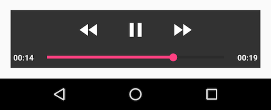
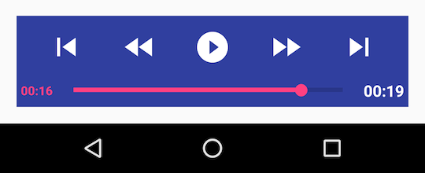

# PlayerControlView

This library provides easily customizable [MediaController](https://developer.android.com/reference/android/widget/MediaController.html) for Android.

### basic UI  



### custom UI  



## Features
- button image is customizable
- text color and size are customizable
- fast forward / rewind time are customizable
- show duration time is customizable
- and this view can stay if needed

## Supported Player
- MediaPlayer
- VideoView
- ExoPlayer1.x
- and Android TV (focusable on images)

ExoPlayer2.x is not supported, please use [PlaybackControlView](https://github.com/google/ExoPlayer/blob/release-v2/library/src/main/java/com/google/android/exoplayer2/ui/PlaybackControlView.java) if needed.

## Install
Add it in your app module build gradle.

```groovy
dependencies {
    compile 'com.github.ogapants:PlayerControlView:1.0.1'
}
```

## Basic Usage

PlayerControlView uses [MediaController.MediaPlayerControl](https://developer.android.com/reference/android/widget/MediaController.MediaPlayerControl.html) interface as a Player.

```java
PlayerControlView playerControlView = new PlayerControlView(this);
playerControlView.attach(this);
playerControlView.setPlayer(/* mediaPlayerControl */);
```

(The previous way was like this)
```java
MediaController mediaController = new MediaController(this);
mediaController.setAnchorView(/* view */);
mediaController.setMediaPlayer(/* mediaPlayerControl */);
```

## How to Customize Time Setting

Java
```java
playerControlView.setFastForwardMs(20_000);
playerControlView.setFastRewindMs(10_000);
playerControlView.setShowTimeoutMs(5_000);//Ignored if alwaysShow is true
playerControlView.setAlwaysShow(true);
```

XML
```xml
<com.github.ogapants.playercontrolview.PlayerControlView
    ...
    app:pcv_fast_forward_ms="20000"
    app:pcv_fast_rewind_ms="10000"
    app:pcv_show_timeout_ms="5000"
    app:pcv_always_show="true"
/>
```

## How to Customize Views
Use PlayerControlView.ViewHolder

```java
PlayerControlView.ViewHolder viewHolder = playerControlView.getViewHolder();
viewHolder.pausePlayButton.setPauseDrawable(/* drawable */);
viewHolder.pausePlayButton.setPlayDrawable((/* drawable */);
viewHolder.controlsBackground.setBackgroundColor(/* color */);
viewHolder.currentTimeText.setTextColor(/* color */);
viewHolder.totalTimeText.setTextSize(/* size */);
```

For other uses, please look at the samples.

## Samples
- MusicActivity (for MediaPlayer)
- VideoViewActivity (for VideoView)
- ExoPlayerActivity (for ExoPlayer1.x)
- CustomizeActivity (for using custom UI with VideoView)

There is a banner for testing this library on AndroidTV :wink:

## License

```
Copyright 2016 ogapants

Licensed under the Apache License, Version 2.0 (the "License");
you may not use this file except in compliance with the License.
You may obtain a copy of the License at

   http://www.apache.org/licenses/LICENSE-2.0

Unless required by applicable law or agreed to in writing, software
distributed under the License is distributed on an "AS IS" BASIS,
WITHOUT WARRANTIES OR CONDITIONS OF ANY KIND, either express or implied.
See the License for the specific language governing permissions and
limitations under the License.
```

[ExoPlayer](https://github.com/google/ExoPlayer)
```
Copyright (C) 2014 The Android Open Source Project

Licensed under the Apache License, Version 2.0 (the "License");
you may not use this file except in compliance with the License.
You may obtain a copy of the License at

    http://www.apache.org/licenses/LICENSE-2.0

Unless required by applicable law or agreed to in writing, software
distributed under the License is distributed on an "AS IS" BASIS,
WITHOUT WARRANTIES OR CONDITIONS OF ANY KIND, either express or implied.
See the License for the specific language governing permissions and
limitations under the License.
```
